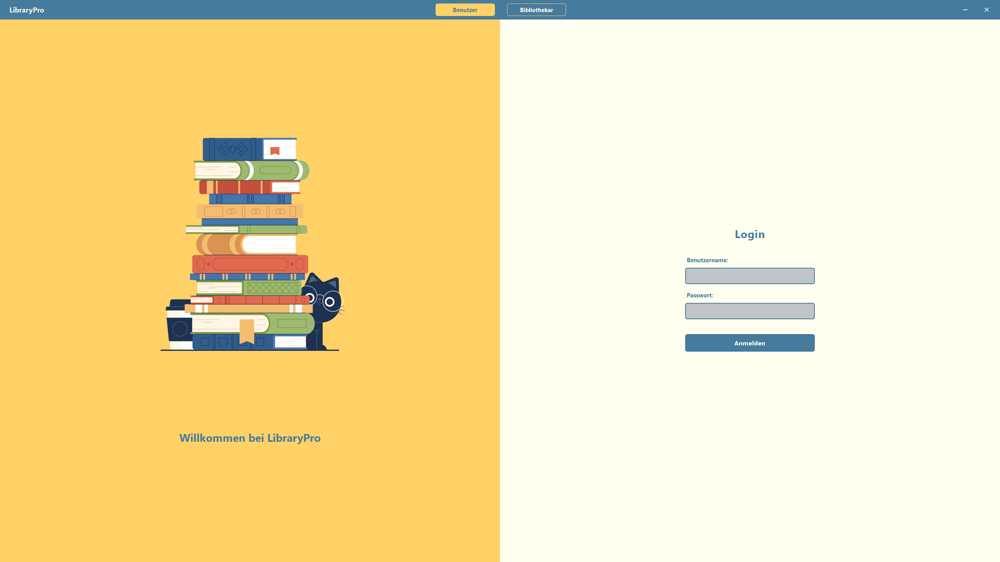
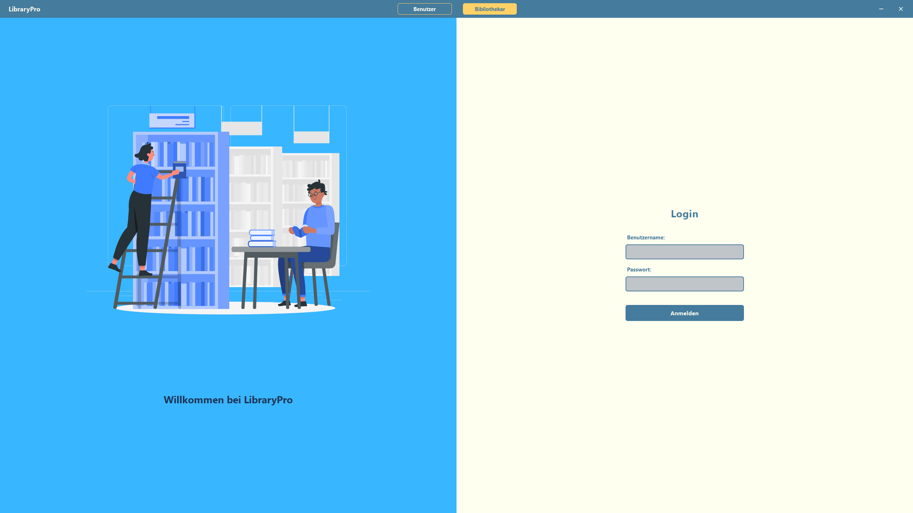
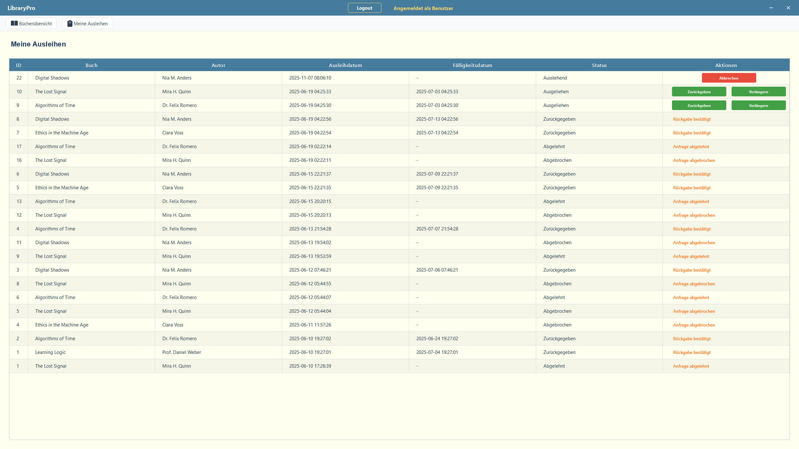
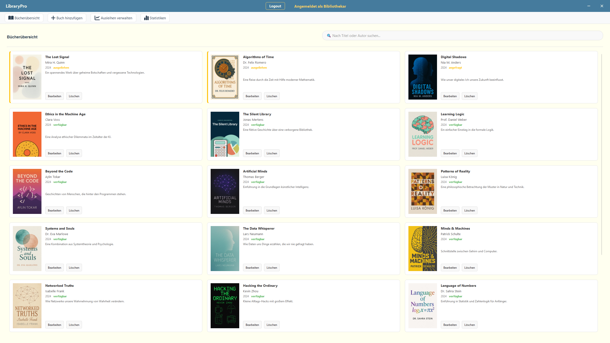
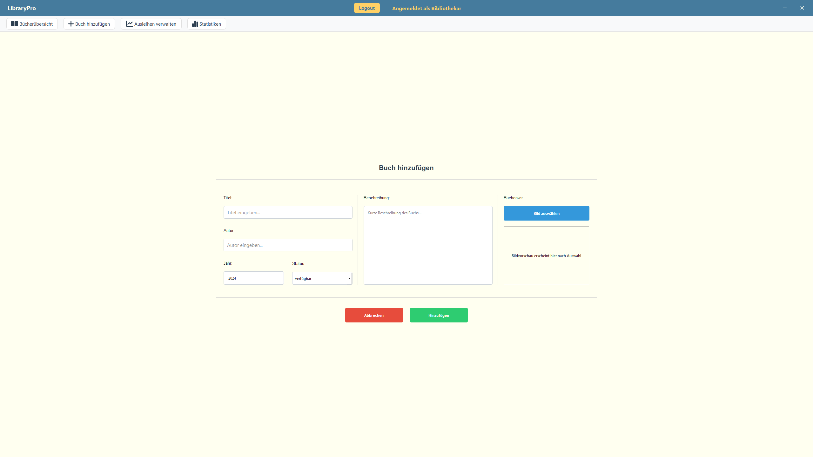
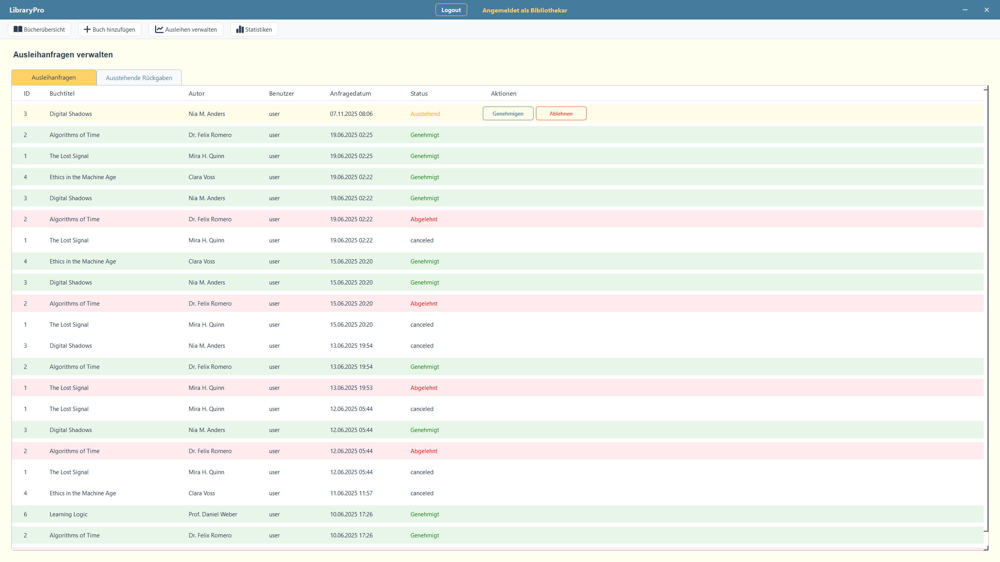
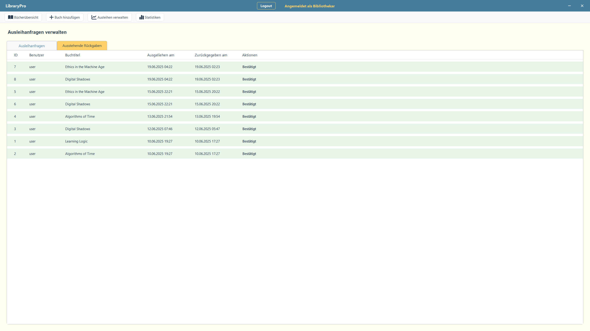
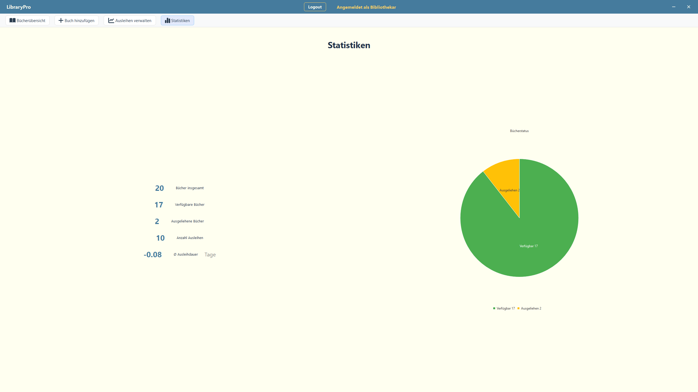

# C++ Projekt: LibraryPro - Bibliothek-Verwaltungssystem

## Projekt-Kontext
Dies ist mein Abschlussprojekt für das Wahlpflichtmodul **"Fortgeschrittene C++ Programmierung"** an der Hochschule Niederrhein.
Ich habe eine vollständige Desktop-Anwendung entwickelt, um die Verwaltung einer Bibliothek zu simulieren. Der Fokus lag dabei auf sauberer Objektorientierung und einer stabilen Architektur.

## Verwendete Technologien

* **Sprache:** C++ (C++17 Standard)
* **Framework:** Qt 6
* **UI-Entwicklung:** Die Benutzeroberfläche wurde komplett im Code geschrieben – **ohne Qt Designer (kein Drag & Drop)**. Dadurch habe ich die volle Kontrolle über das Layout-Management und die Widget-Logik.
* **Datenbank:** **SQLite** (lokale Einbindung, keine Server-Installation nötig).
* **Design:** Eigenes QSS (Qt Style Sheets) für einen modernen Look.

## Datenbank & Speicher
Das Programm nutzt eine lokale **SQLite-Datenbank**, damit alle Daten (Bücher, Nutzer, Ausleihen) auch nach einem Neustart erhalten bleiben. Über SQL-Abfragen werden die Daten verknüpft, sodass man z.B. die komplette Ausleih-Historie eines Nutzers sehen kann.

## Features
Die App unterscheidet zwischen zwei Rollen:

### 👤 Für Benutzer (Ausleiher)
* **Katalog:** Bücher durchsuchen und Verfügbarkeit prüfen.
* **Ausleihen:** Bücher direkt per Klick anfragen.
* **Dashboard:** Übersicht über alle eigenen Ausleihen (aktuell und historisch) sowie den Rückgabe-Status.

### 🛡️ Für Bibliothekare (Admin)
* **Verwaltung:** Neue Bücher anlegen, bearbeiten oder löschen (CRUD).
* **Anfragen-Management:** Eingehende Ausleih-Anfragen von Nutzern genehmigen oder ablehnen.
* **Rückgaben:** Zurückgebrachte Bücher im System erfassen.
* **Statistik:** Ein Dashboard mit Diagramm zeigt den aktuellen Bestand und Status der Bibliothek.

## Screenshots

**(1) Login**

**(2) Bücher-Katalog (Benutzer-Ansicht)**

**(3) Ausleih-Dashboard (User)**

**(4) Admin-Verwaltung**

**(5) Anfragen & Rückgaben verwalten**

**(6) Statistik**

